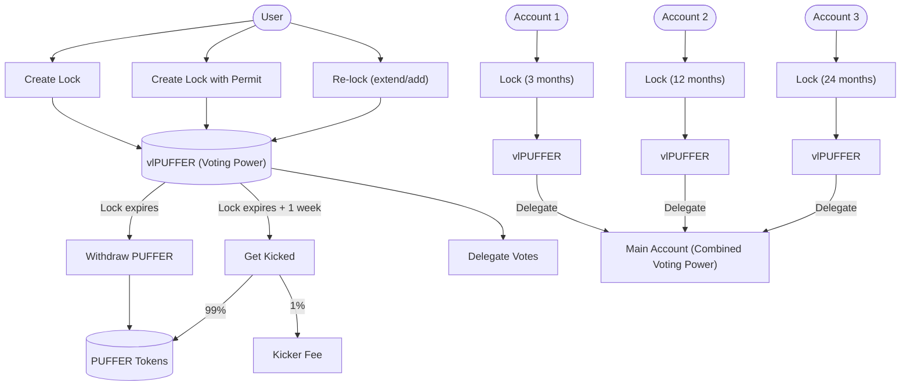

# vlPUFFER: Voting & Locking for PUFFER

This document explains how the vlPUFFER system works in simple terms. vlPUFFER is a voting system where you lock your PUFFER tokens to gain voting power.

## How It Works

- You lock your PUFFER tokens for a period of time (30 days to 2 years)
- The longer you lock, the more voting power (vlPUFFER tokens) you receive
- Your vlPUFFER tokens cannot be transferred - they represent your voting power
- Once your lock period ends, you can withdraw your original PUFFER tokens

## Multiplier System

The amount of vlPUFFER (voting power) you receive depends on how long you lock:

| Lock Duration | Multiplier |
|---------------|------------------------|
| 30 days       | 1x                     |
| 3 months      | 3x                     |
| 6 months      | 6x                     |
| 9 months      | 9x                     |
| 12 months     | 12x                    |
| 18 months     | 18x                    |
| 24 months     | 24x                    |

For example, if you lock 100 PUFFER for 12 months, you'll receive 1200 vlPUFFER tokens.

## Entry Points (How to Lock)

1. **Create a new lock** - Lock your PUFFER tokens for the first time
2. **Create a lock with permit** - Lock your tokens in a single transaction
3. **Re-lock** - You can:
   - Add more PUFFER to your existing lock
   - Extend your lock duration
   - Both add more tokens and extend the duration to get more vlPUFFER tokens

Minimum lock amount: 10 PUFFER

## Exit Points (How to Unlock)

1. **Withdraw** - Once your lock expires, you can withdraw your PUFFER tokens
2. **Get kicked** - If you don't withdraw within 1 week after expiry, anyone can "kick" you:
   - The kicker receives 1% of your PUFFER tokens
   - The remaining 99% are returned to you automatically

## Vote Delegation

vlPUFFER supports vote delegation, allowing you to:

- Delegate your voting power to another address (including yourself)
- By default, new locks are automatically self-delegated if you haven't chosen a delegate
- Delegation is handled by OpenZeppelin's `lib/openzeppelin-contracts/contracts/governance/utils/Votes.sol` contract

### Multiple Account Strategy

You can optimize your locking strategy using multiple accounts:

1. Create different locks with different durations from separate accounts
   - For example: 3 months in one account, 12 months in another, 24 months in a third
2. Delegate the voting power from all these accounts to your main account
3. This gives you flexibility to have different unlock schedules while concentrating voting power

## Interaction Flow

## Important Notes

- You can only withdraw after your lock period ends.
- You can only have one lock at a time.
- Your vlPUFFER tokens cannot be transferred to other addresses
- If you don't withdraw within 1 week after lock expiry, anyone can kick you and receive 1% of your PUFFER tokens
- Re-locking cannot result in less voting power than you currently have
- When re-locking, the new lock duration must be longer than your current lock
